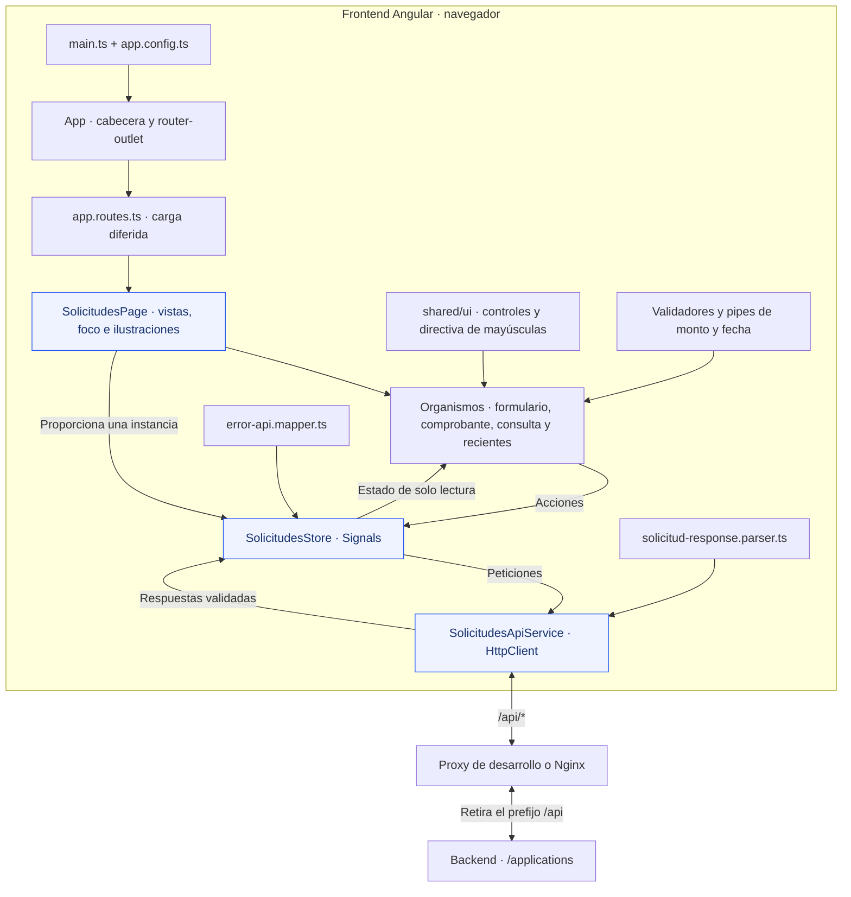
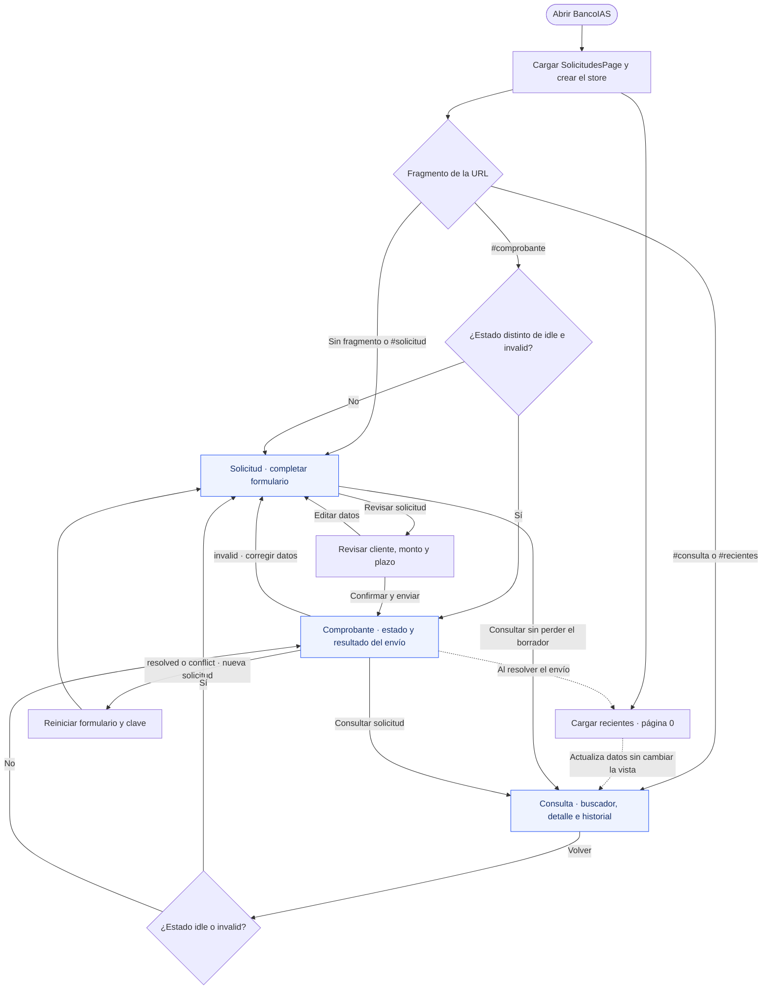
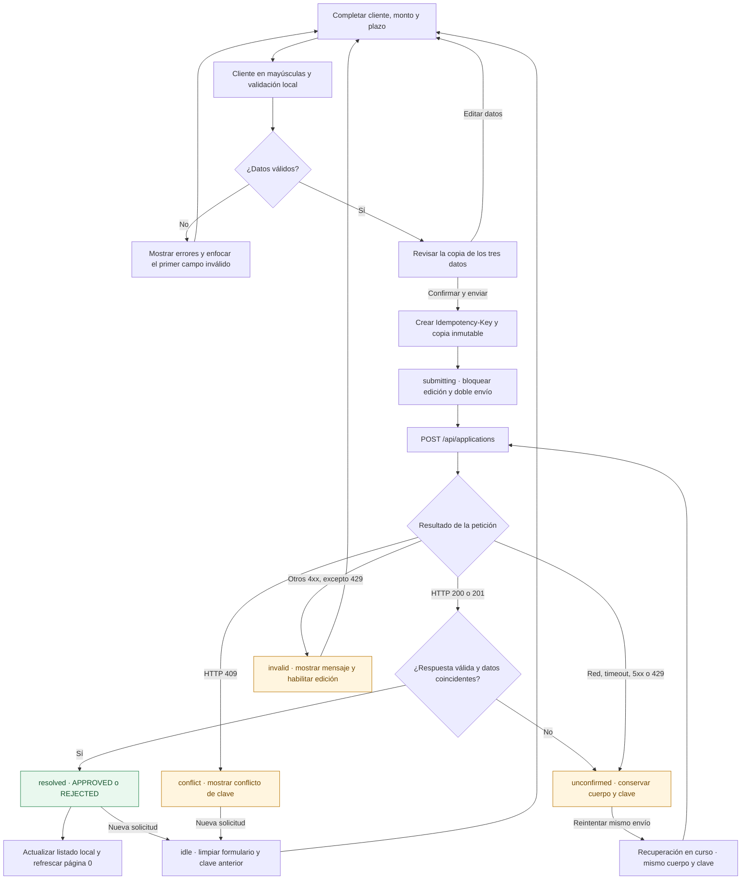
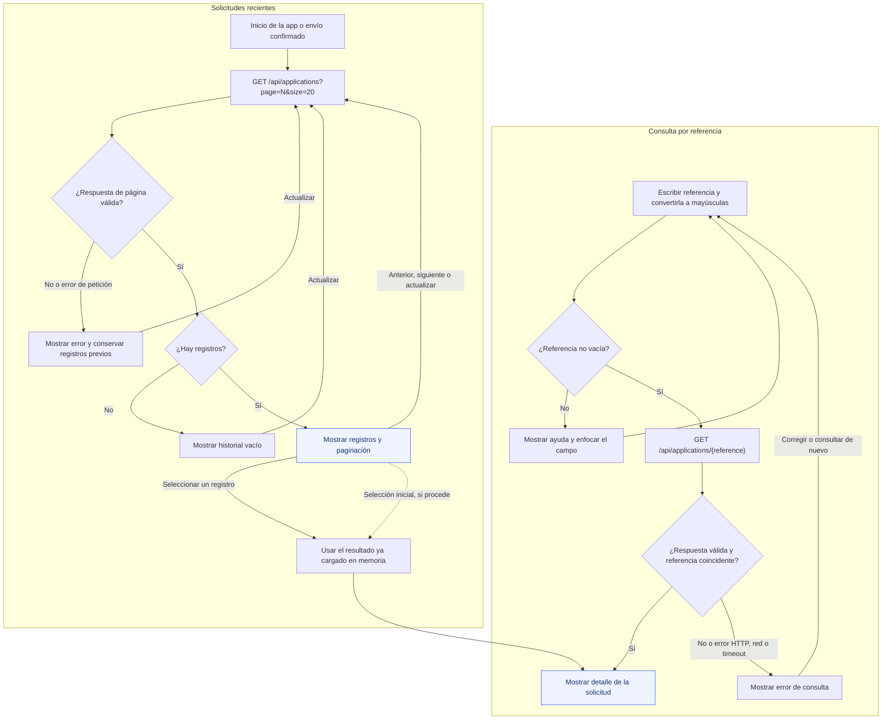

<div align="center">
  

  <h1>BancoIAS · Solicitudes de crédito</h1>

  <p><strong>Tu próximo gran comienzo, en unos pocos pasos.</strong></p>
  <p>Registra tu solicitud, revisa los datos y consulta el resultado desde una interfaz clara y cercana.</p>

  <p>
    
    
    
    
  </p>

  

  <p>
    <a href="#primeros-pasos">Primeros pasos</a> ·
    <a href="#ejecutar-con-docker">Docker</a> ·
    <a href="#comandos-útiles">Comandos</a> ·
    <a href="#estructura-del-proyecto">Estructura</a> ·
    <a href="#flujo-de-la-aplicación">Flujo de la app</a> ·
    <a href="#documentación">Documentación</a>
  </p>
</div>

---

**BancoIAS** es un frontend construido con Angular para gestionar solicitudes de crédito. Se conecta con un backend real para registrar operaciones, mostrar sus resultados y explorar el historial, con la identidad visual de IAS Software.

## Qué puedes hacer

| Funcionalidad                       | Así te acompaña                                                                                                        |
| ----------------------------------- | ---------------------------------------------------------------------------------------------------------------------- |
| 📝 **Crear una solicitud**          | Ingresa el cliente, el monto en pesos colombianos y un plazo de 6 a 60 meses, con validaciones y ayudas en cada campo. |
| 👀 **Revisar antes de enviar**      | Confirma los datos o vuelve a editarlos antes de registrar la operación.                                               |
| 🧾 **Ver el comprobante**           | Consulta el estado, la referencia y el mensaje que devuelve el backend.                                                |
| 🔎 **Consultar y explorar**         | Busca por referencia o recorre las solicitudes recientes, en páginas de hasta 20 registros.                            |
| 🔁 **Recuperar un envío**           | Si la respuesta queda sin confirmar, reintenta con los mismos datos y la misma clave de idempotencia.                  |
| 📱 **Usarlo en cualquier pantalla** | Diseño adaptable, navegación por teclado, foco visible y animaciones que respetan el movimiento reducido.              |

El recorrido se organiza en tres vistas: **solicitud → comprobante → consulta**. Puedes alternar entre ellas sin perder el borrador durante la sesión; las ilustraciones acompañan el campo que estás completando.

## Primeros pasos

### 1. Prepara tu entorno

- **Node.js 24 LTS**: se recomienda `24.21.0`, la versión de [`.nvmrc`](.nvmrc). El proyecto admite `>=24.15.0 <25`.
- **npm 11**.
- **Backend de créditos** disponible en `http://localhost:8080` para registrar y consultar solicitudes.

### 2. Instala e inicia

Desde la raíz del repositorio:

```bash
npm ci
npm start
```

### 3. Abre la aplicación

Visita **[http://localhost:4200](http://localhost:4200)**. El servidor de desarrollo actualiza la aplicación cuando guardas cambios.

Las peticiones a `/api/*` se redirigen al backend mediante [`proxy.conf.cjs`](proxy.conf.cjs), eliminando el prefijo `/api`. Si tu backend usa otra dirección, modifica `target` en ese archivo y reinicia `npm start`.

## Ejecutar con Docker

Necesitas **Docker con Docker Compose** y el backend en ejecución.

1. Crea un archivo `.env` en la raíz a partir de [`.env.example`](.env.example). Para conectar con un backend que corre en tu equipo, el valor de referencia es:

   ```dotenv
   BACKEND_URL=http://host.docker.internal:8080
   ```

2. Construye e inicia el frontend:

   ```bash
   docker compose up --build -d
   ```

3. Abre **[http://localhost:4200](http://localhost:4200)**.

Para detenerlo:

```bash
docker compose down
```

La imagen compila Angular y sirve la aplicación con **Nginx**. `BACKEND_URL` configura el proxy de Docker; el desarrollo con `npm start` utiliza `proxy.conf.cjs`.

Más detalles en la [guía de Docker](DOCKER.md).

## Comandos útiles

| Comando                     | Para qué sirve                                                    |
| --------------------------- | ----------------------------------------------------------------- |
| `npm start`                 | Inicia el servidor de desarrollo en el puerto 4200.               |
| `npm run build`             | Genera la compilación de producción en `dist/`.                   |
| `npm run watch`             | Recompila en modo desarrollo al guardar cambios.                  |
| `npm test`                  | Ejecuta las pruebas con Vitest.                                   |
| `npm test -- --watch=false` | Ejecuta las pruebas una sola vez.                                 |
| `npm run format:check`      | Comprueba el formato del código y los archivos JSON configurados. |
| `npm run format`            | Aplica Prettier al código y los archivos JSON configurados.       |

Las pruebas cubren validadores, respuestas de la API, manejo de errores, estado de la aplicación, protección contra doble envío, recuperación, navegación y conservación del borrador.

## Tecnologías

- **Angular 22.2 + TypeScript 6.0**: componentes standalone, tipado estricto y Reactive Forms.
- **Signals + RxJS + HttpClient**: estado reactivo y comunicación con la API.
- **SCSS**: identidad visual clara, tipografía Montserrat e ilustraciones propias del proyecto.
- **Vitest + jsdom**: pruebas automatizadas.
- **Docker + Nginx**: compilación y servicio del frontend en un contenedor.

## Estructura del proyecto

La aplicación se organiza por funcionalidad. Este mapa reúne los archivos principales y la responsabilidad de cada carpeta:

```text
front-IAS/
├── public/                                  # Logo, favicon e ilustraciones
├── src/
│   ├── index.html                           # Documento HTML de entrada
│   ├── main.ts                              # Arranque de Angular
│   ├── styles.scss                          # Estilos y tokens globales
│   └── app/
│       ├── app.ts                           # Componente raíz
│       ├── app.html                         # Cabecera, navegación y router-outlet
│       ├── app.scss                         # Estilos del contenedor principal
│       ├── app.config.ts                    # Proveedores de Router y HttpClient
│       ├── app.routes.ts                    # Carga diferida de la página y redirección
│       ├── features/solicitudes/
│       │   ├── api/
│       │   │   ├── solicitudes-api.service.ts      # POST, consulta y paginación
│       │   │   ├── solicitud-response.parser.ts    # Validación del JSON recibido
│       │   │   └── error-api.mapper.ts             # Errores HTTP a mensajes de UI
│       │   ├── models/
│       │   │   └── solicitud.model.ts              # DTO, resultados y estados
│       │   ├── pages/solicitudes-page/             # Tres vistas, foco e ilustraciones
│       │   ├── state/
│       │   │   └── solicitudes.store.ts            # Signals, acciones y recuperación
│       │   ├── ui/
│       │   │   ├── organisms/
│       │   │   │   ├── solicitud-form/             # Campos, revisión y descarte
│       │   │   │   ├── solicitud-resultado/        # Comprobante y resultado-detalle
│       │   │   │   ├── consulta-referencia/        # Buscador por referencia
│       │   │   │   ├── consulta-resultado/         # Resultado de la búsqueda
│       │   │   │   └── solicitudes-recientes/      # Listado, selección y paginación
│       │   │   └── pipes/
│       │   │       ├── monto-cop.pipe.ts           # Formato monetario sin redondeos
│       │   │       └── fecha-solicitud.pipe.ts     # Fecha en America/Bogota
│       │   └── validation/
│       │       └── solicitud-form.validators.ts    # Cliente, monto y plazo
│       └── shared/ui/
│           ├── atoms/
│           │   ├── indicador-carga.ts        # Indicador de operación en curso
│           │   └── mensaje.ts                # Mensajes y avisos accesibles
│           ├── molecules/
│           │   └── campo.ts                  # Etiqueta, ayuda y error del campo
│           └── directives/
│               └── mayusculas.directive.ts   # Normalización de identificadores
├── angular.json                             # Compilación, desarrollo y pruebas
├── package.json                             # Dependencias y comandos npm
├── package-lock.json                        # Versiones resueltas de dependencias
├── tsconfig.json                            # Configuración base de TypeScript
├── tsconfig.app.json                        # Configuración de la aplicación
├── tsconfig.spec.json                       # Configuración de las pruebas
├── proxy.conf.cjs                           # Proxy del servidor de desarrollo
├── Dockerfile                               # Compilación con Node y servicio con Nginx
├── compose.yaml                             # Contenedor, puerto y URL del backend
├── nginx.conf                               # Rutas del frontend y proxy de la API
├── .env.example                             # Ejemplo de BACKEND_URL para Docker
├── .nvmrc                                   # Versión recomendada de Node.js
├── README.md                                # Guía de entrada al proyecto
├── DOCKER.md                                # Operación del contenedor
└── USO_IA.md                                # Proceso y referencias de diseño
```

Los componentes mantienen sus plantillas `.html` y estilos `.scss` junto al archivo `.ts` cuando corresponde. Las pruebas `*.spec.ts` también viven junto al código que verifican.

### Cómo se conectan las piezas

El formulario gestiona sus campos y validaciones; `SolicitudesStore` coordina envíos, consultas e historial; `SolicitudesApiService` concentra el acceso HTTP. `SolicitudesPage` proporciona una única instancia del store a sus organismos.



## Flujo de la aplicación

Los diagramas están escritos en **Mermaid** y se visualizan directamente en GitHub. El recorrido comienza en la ruta `/`; las rutas desconocidas redirigen allí. Los fragmentos de la URL eligen la vista dentro de la misma página.

### Recorrido general



- **Tres vistas persistentes:** `#solicitud`, `#comprobante` y `#consulta` conservan sus componentes y el estado compartido. `#recientes` abre la consulta y lleva el foco al historial.
- **Borrador:** se conserva al navegar. «Descartar datos» pide confirmación si fue modificado; «Conservar borrador» permite seguir editando.
- **Ilustraciones:** el foco en cliente, monto o plazo selecciona la escena. La página espera 200 ms, precarga y decodifica la imagen y aplica la transición; prevalece la última selección y se respeta el movimiento reducido. Este flujo visual mantiene intactos los datos de la solicitud.

<details>
<summary><strong>📝 Ver el flujo de creación, validación y recuperación</strong></summary>

### Del formulario al comprobante



El timeout de las peticiones es de **15 segundos** por defecto. Una respuesta incompatible también deja el envío en `unconfirmed`. Los reintentos son manuales: mientras uno está activo, el botón se bloquea y el estado conserva la recuperación en curso. Un resultado `REJECTED` es una decisión confirmada del backend.

Al confirmar, el historial se actualiza por referencia cuando corresponde a su primera página y luego se consulta nuevamente la página 0. Un error de ese GET conserva el resultado del envío y los registros que ya estaban disponibles.

</details>

<details>
<summary><strong>🔎 Ver el flujo de consulta, historial y paginación</strong></summary>

### Buscar una referencia o explorar registros



- Al cargar los primeros registros, se selecciona uno automáticamente si la consulta sigue vacía, sin errores ni petición en curso. Esta selección se realiza una sola vez y utiliza los datos del listado.
- Seleccionar una fila muestra su detalle sin otro GET. La búsqueda escrita sí consulta la API, codificando la referencia como segmento de URL.
- Una nueva búsqueda o carga de página cancela la lectura anterior de ese mismo tipo. Consulta e historial mantienen indicadores y errores independientes.
- La paginación utiliza índices desde `0`, con hasta `20` registros por página. Si la página solicitada dejó de existir, el store solicita la última disponible.
- Consultar, actualizar o paginar conserva el borrador y el resultado del último envío.

</details>

## Integración con el backend

El navegador utiliza rutas relativas bajo `/api`. Tanto el proxy de desarrollo como Nginx retiran ese prefijo antes de reenviar la petición.

| Método | Ruta del frontend                  | Uso                                                          |
| ------ | ---------------------------------- | ------------------------------------------------------------ |
| `POST` | `/api/applications`                | Registrar una solicitud con el encabezado `Idempotency-Key`. |
| `GET`  | `/api/applications/{reference}`    | Consultar una solicitud por su referencia.                   |
| `GET`  | `/api/applications?page=0&size=20` | Obtener una página del historial.                            |

<details>
<summary><strong>Detalles importantes si vas a modificar el flujo</strong></summary>

- **Montos exactos:** `amount` viaja como un `string` decimal en COP, con punto decimal y sin separadores de miles. Se conserva sin conversiones a punto flotante ni redondeos.
- **Confirmación explícita:** el POST ocurre después de revisar cliente, monto y plazo y pulsar «Confirmar y enviar».
- **Identificadores consistentes:** el cliente y la referencia de búsqueda se convierten a mayúsculas antes de la petición, sin recortar espacios. La referencia de la solicitud la genera el backend.
- **Reintentos consistentes:** se conservan el cuerpo exacto y la misma `Idempotency-Key`; una solicitud nueva recibe otra clave.
- **Resultados fieles:** un error de red, timeout, error 5xx o respuesta incompatible deja el envío sin confirmar. La aprobación o el rechazo provienen del backend.
- **Estado independiente:** envío, consulta e historial tienen sus propios estados de carga y error. El historial se actualiza por referencia para evitar duplicados.
- **Navegación persistente:** `#solicitud`, `#comprobante` y `#consulta` comparten la misma página y la misma instancia del store. Cambiar de vista o de ilustración conserva el formulario.

</details>

## Preguntas frecuentes

**¿La interfaz abre, pero las solicitudes fallan?**

Comprueba que el backend esté disponible y que su dirección coincida con `proxy.conf.cjs` en desarrollo o con `BACKEND_URL` en Docker. Los registros y resultados se obtienen de la API real.

**¿Se conserva el borrador al cerrar o recargar la pestaña?**

El borrador se mantiene en memoria mientras navegas entre las vistas. Al recargar o cerrar la pestaña se pierde; las solicitudes ya registradas en el backend se pueden consultar por referencia.

**¿Incluye inicio de sesión?**

El alcance actual es una demostración local del flujo de crédito, sin autenticación ni autorización.

## Documentación

| Recurso                                               | Qué encontrarás                                                               |
| ----------------------------------------------------- | ----------------------------------------------------------------------------- |
| [Guía de Docker](DOCKER.md)                           | Configuración del contenedor, proxy y conexión con el backend.                |
| [Estructura y arquitectura](#estructura-del-proyecto) | Organización del código y comunicación entre los componentes.                 |
| [Flujo de la aplicación](#flujo-de-la-aplicación)     | Navegación, creación, recuperación, consulta e historial.                     |
| [Uso de IA y referencias de diseño](USO_IA.md)        | Proceso de implementación, decisiones visuales y verificaciones documentadas. |
